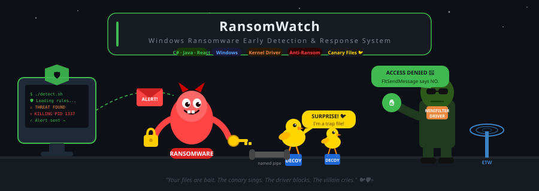
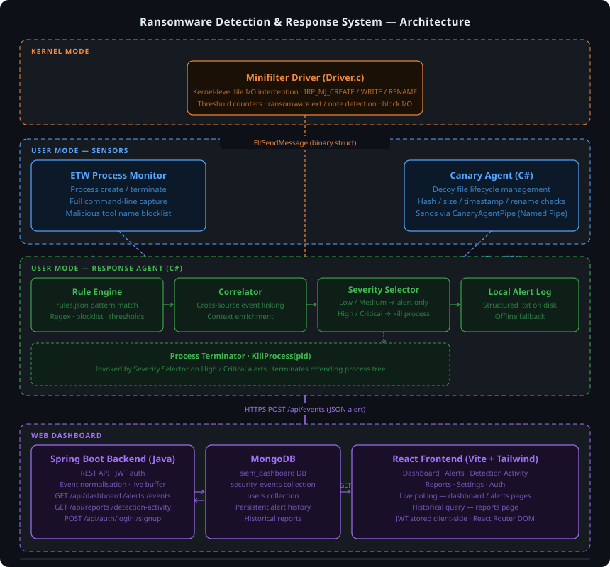

# 🛡️ RansomwareShield

<div align="center">


## Windows-Based Early Ransomware Detection and Response System

### using Canary Files & Behavioural Analysis


</div>

---

# 📖 Overview

### 🛡️ RansomwareShield
a Windows-based cybersecurity project designed to detect, monitor, and respond to ransomware attacks during their early execution stages before large-scale file encryption and system damage occur.
The project combines multiple defensive layers operating in both **user mode** and **kernel mode** to provide real-time ransomware detection through behavioral analysis, file system monitoring, process activity inspection, and automated defensive response mechanisms.
Instead of relying solely on traditional signature-based antivirus detection, RansomwareShield focuses on behavior-driven analysis to identify suspicious activities commonly associated with modern ransomware attacks.
.

### Core Detection Layers :

* 🎯 **Dynamic Canary File Detection**
* ⚙️ **Kernel-level Minifilter Driver**
* 🔍 **ETW Process Event Monitoring**
* 🧠 **Behavioral & Process Analysis**
* 🛑 **Automated Threat Response**
* 📊 **Web-Based Monitoring Dashboard**

 # 📌 Detection Capabilities

| Detection Type                      | Supported |
| ----------------------------------- | --------- |
| Canary File Access                  | ✅         |
| Mass File Encryption Attempts       | ✅         |
| Rapid File Modification Activity    | ✅         |
| Mass File Renaming                  | ✅         |
| Ransom Note Creation                | ✅         |
| Abnormal Write-Frequency Detection  | ✅         |
| Suspicious PowerShell Execution     | ✅         |
| Script-Based Execution Detection    | ✅         |
| Shadow Copy Deletion Attempts       | ✅         |
| Malicious Process Execution Chains  | ✅         |
| Ransomware File Extension Detection | ✅         |
| Excessive I/O Request Detection     | ✅         |


---

# ✨ Components 

## 🐤 Canary Agent

The Canary Agent operates in user mode and is responsible for generating and monitoring decoy files that imitate realistic user documents.

The agent creates believable fake files using generated datasets and continuously watches for unauthorized access, modification, deletion, or encryption attempts. Since ransomware commonly targets user documents first, interacting with these canary files acts as an early warning indicator.

When suspicious activity is detected, the Canary Agent immediately sends alerts to the Response Agent using Named Pipes communication in JSON format.
### Canary Agent Responsibilities
* **Generate realistic decoy files**
* **Monitor file access behavior**
* **Detect unauthorized modifications**
* **Trigger early ransomware alerts**
* **Communicate alerts to the Response Agent**

---

## ⚙️ Minifilter Driver

The Minifilter Driver operates at the Windows kernel level and monitors low-level file system operations in real time.

The driver observes file creation, deletion, renaming, and modification activities to detect ransomware-like behaviors such as mass file encryption, abnormal write frequency, suspicious extensions, and ransom note creation patterns.

The driver also supports defensive blocking capabilities by intercepting and denying malicious I/O requests when dangerous behavior thresholds are exceeded.

Communication between kernel mode and user mode is implemented using FltSendMessage.

## Minifilter Driver Responsibilities
* **Monitor file system activity**
* **Detect abnormal file operations**
* **Detect ransomware extensions and notes**
* **Track excessive write operations**
* **Block malicious I/O requests**
* **Send kernel alerts to user mode**

---

## 🔍 ETW Process Monitoring

The ETW Process Monitor uses Event Tracing for Windows (ETW) to observe process-related activities and suspicious execution behavior.

This component monitors:

* **Process creation**
* **PowerShell execution**
* **Script execution**
* **Suspicious command-line arguments**
** **Abnormal execution chains**
* **Potential ransomware behaviors**

Behavioral indicators are analyzed against a ransomware behavior dataset collected from public reports and threat intelligence references.

The ETW monitor strengthens detection by identifying malicious activity that may not yet interact directly with files.

## ETW Process Monitor Responsibilities
* **Monitor process activity**
* **Detect suspicious execution patterns**
* **Analyze command-line behavior**
* **Detect script abuse**
* **Identify ransomware indicators**
* **Generate behavioral alerts**


---

## 🚨 Response Agent

The Response Agent acts as the central coordination and defensive response component of the framework.

It receives alerts from:

* **Canary Agent**
* **Minifilter Driver**
* **ETW Process Monitor**

The Response Agent correlates incoming events, classifies threat severity, and performs automated response actions such as:

* **Process termination**
* **Alert forwarding**
* **Event logging**
* **Dashboard synchronization**

The Response Agent also standardizes communication using JSON-formatted data exchange between all system components.

## Response Agent Responsibilities

* **Collect alerts from all modules**
* **Correlate suspicious activities**
* **Execute automated response actions**
* **Terminate suspicious processes**
* **Forward logs to the dashboard**
* **Manage inter-component communication**
---

## 📊 Web Dashboard

The Web-Based Dashboard provides centralized real-time monitoring and visualization for system alerts and ransomware activities.

The dashboard displays:

* **Detected ransomware events**
* **Suspicious process information**
* **Severity levels**
* **Timestamps**
* **Response actions**
* **File activity logs**
* **Detection statistics**

The frontend was developed using React, while the backend uses Spring Boot APIs and MongoDB for event storage.

## Dashboard Responsibilities
* **Display real-time alerts**
* **Visualize system activity**
* **Store monitoring logs**
* **Provide centralized monitoring**
* **Display threat severity information**
* **Improve system usability and analysis**
---

# 🏗️ System Architecture


# 📂 Project Structure

```bash
RansomwareShield/
│
├── CanaryAgent/
├── MinifilterDriver/
├── ETWMonitor/
├── ResponseAgent/
├── DashboardFrontend/
├── DashboardBackend/
├── Dataset/
├── Docs/
└── README.md
```

---

# 🚀 Installation & Deployment Guide

## 📋 Requirements 
Before running the project, you should have :

* Windows 10 / Windows 11
* Visual Studio 2022
* Windows Driver Kit (WDK)
* Windows SDK
* Java JDK
* Apache Maven
* Node.js & npm
* MongoDB

---

# ⚙️ Installation & Deployment Guide

⚠️ IMPORTANT:

RansomwareShield interacts with low-level Windows kernel components and should ONLY be deployed inside isolated virtual machine environments.

Recommended:

* VMware
* VirtualBox

Do NOT test ransomware samples on a host machine.
---

# 📚 Manual Usage

### 🖥️ Step 1 — Setup Virtual Machine
* Install Windows 10/11 inside a VM
* Update Windows
* Enable VM snapshots
* Install all required software

### 🛠️ Step 2 — Install Visual Studio & WDK

Install:

* Visual Studio Community 2022
* Windows Driver Kit (WDK)
* Windows SDK
* x64/x86 C++ Spectre Libraries

Enable workloads:

* Desktop Development with C++
* Windows Driver Development
  
### 🔐 Step 3 — Enable Test Signing Mode

Open PowerShell as Administrator:

```powershell
bcdedit /set testsigning on
```
Reboot the virtual machine.

After reboot:
* Verify “Test Mode” appears on the desktop.
  
### ⚙️ Step 4 — Build the Minifilter Driver
* Open Visual Studio as Administrator
* Create:
   * Kernel Mode Driver, Empty (KMDF)
* Configure:
  * Project Name: MiniFilter
  * Platform: x64
* Add:
  * Driver.c
* Copy the Minifilter source code into Driver.c
  
**Configure Driver Dependencies**

Navigate to:

```text
Project → Properties → Linker → Input
```

Append:

```text
fltMgr.lib
```

Enable:

* Driver Signing → Test Sign

Build the solution.

Generated driver:

```text
\MiniFilter\x64\Debug\MiniFilter.sys
```

### 📦 Step 5 — Register the Driver

Open CMD as Administrator:

```cmd 
copy \x64\Debug\MiniFilter.sys C:\Windows\System32\drivers\
```

Register the service:

```cmd 
reg add "HKLM\SYSTEM\CurrentControlSet\Services\MiniFilter" /v Type /t REG_DWORD /d 2 /f
```
(Additional registry configuration may be required.)

### 🌐 Step 6 — Setup Dashboard

Install:

* Java JDK
* Apache Maven
* Node.js
* MongoDB

Add to Environment Variables:

```cmd
jdk-26.0.1\bin
apache-maven-3.9.14\bin
```

Move:

* sim-dashboard
* backend-java

to Desktop.

Install frontend dependencies:
```cmd
cd Desktop\sim-dashboard
npm install
```
Verify installation:
```cmd
node -v
npm -v
```
### 🗄️ Step 7 — Configure MongoDB
* Open MongoDB Compass
* Create a new connection:
   * siem_dashboard
### 🐤 Step 8 — Build Canary Agent
* Open CanaryAgent in Visual Studio
* Build Solution
* Run in Debug Mode
### 🚨 Step 9 — Build Response Agent
* Open ResponseAgent
* Build Solution
* Run in Debug Mode
### 🔍 Step 10 — Run ETW Monitor
* Open the ETW monitoring project
* Build the solution
* Run as Administrator
### 🧪 Step 11 — Execute Ransomware Testing
⚠️ VM ONLY
* Execute ransomware sample
* Observe:
  * Canary alerts
  * Minifilter detections
  * ETW detections
  * Process termination
  * Dashboard logs
### 📊 Step 12 — Monitor Dashboard

Open the dashboard in browser and monitor:
 * Alerts
 * Severity Levels
 * File Activity
 * Process Activity
 * Response Actions
 * Detection Logs

---

## 🐤 Canary Files - IMPORTANT

The system automatically:

* Creates fake files
* Places them in directories
* Monitors them continuously

Do NOT manually modify canary files.

---

## 🚨 Alert Monitoring

When ransomware behavior is detected:

The dashboard displays:

* Timestamp
* Severity
* Source
* Rule Name
* Response Action

Severity Levels:

* 🟢 Low
* 🟡 Medium
* 🟠 High
* 🔴 Critical

---

## 🛑 Automated Response

For High/Critical threats:

* Suspicious process is terminated automatically
* Alert is logged
* Dashboard updates instantly

---

# 📈 Future Improvements

* 🌐 Network-based ransomware detection
* 🔐 Encryption level detection
* 📁 Suspecious API detection
* ☁️ Cloud dashboard deployment
* 🤖 Machine learning integration
* 🔔 Email/SMS alerting
* 🧩 SIEM integration
* 🐧 Linux support


---

<div align="center">

## 🛡️ Detect Early. Respond Fast. Stay Protected.

</div>
